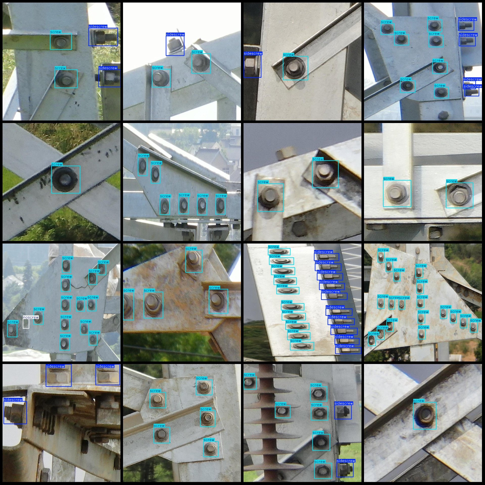
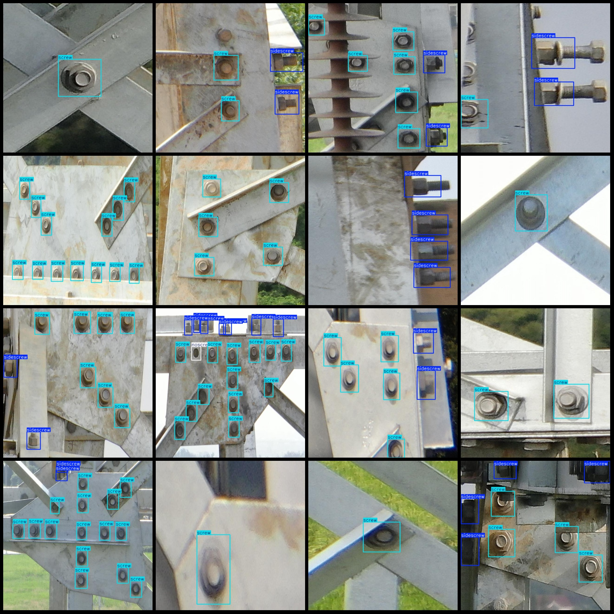

# Power Scenario: Missing Bolt, Screw, Nut Detection Dataset VOC+YOLO Format with 857 Images in 3 Classes

Dataset format: Pascal VOC format + YOLO format (txt file without split path, only contain jpeg images and corresponding VOC format xml files and yolo format txt files)
Number of images (jpg file counts): 857
Number of annotations (xml file counts): 857
Number of annotations (txt file counts): 857
Number of categories: 3
Category names in the annotation (Note that the order of labels in the yolo format is not consistent with this, but based on the classes.txt in the labels folder): ["no screw", "screw", "sidescrew"]
Each category annotation box count:
noscrew (no bolt) box count = 99
screw (bolt) box count = 3864
sidescrew (side bolt) box count = 1638
Total box count: 5601
Image resolution: 640x640
Annotation tool used: labelImg
Annotation rules: draw a box for each category
Important note: No specific information provided
Special Notice: This dataset does not guarantee the accuracy of the trained model or the weight files.
Preview:
## Image

Here is a pay link on Stripe ( https://buy.stripe.com/3cs8yP7sY87d0vu9AB ). Please contact me lonlonago@foxmail.com after funding $89, and I will send you a complete data files , thank you!

